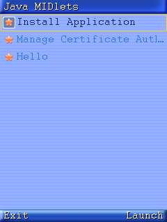
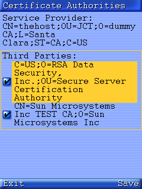
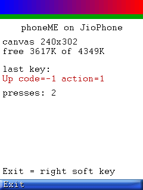
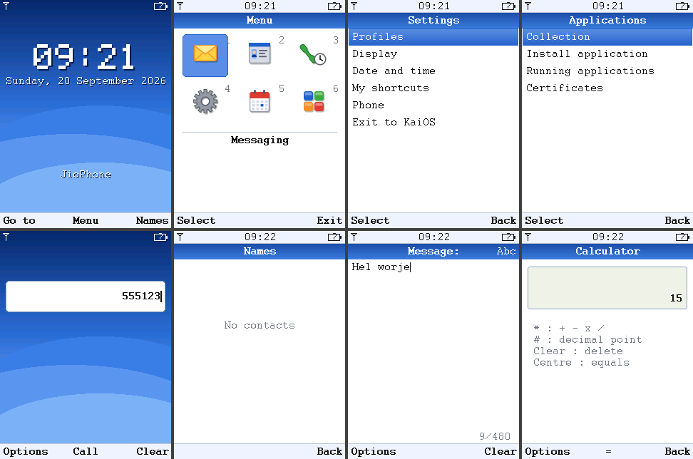
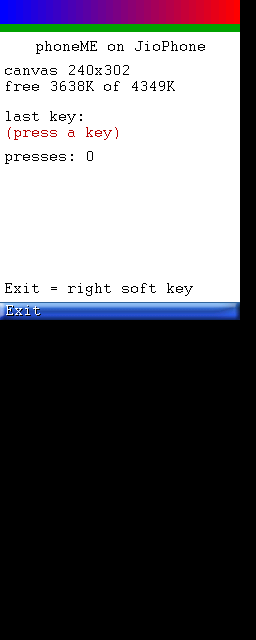

# os/ — native phoneME on the JioPhone framebuffer

Sun's **phoneME Feature** (CLDC-HI VM + MIDP 2.1, plain C/C++) cross-compiled
for the JioPhone LF-2403N and run **directly on `/dev/graphics/fb0` and the
evdev keypad**, with KaiOS/Gecko (`b2g`) stopped. No browser, no JS VM: the
Java bytecode runs on a JIT-ing ARM VM and paints straight into the LCD. It
feels like a J2ME feature phone OS: the **S100 shell** in `os/port/` (a
Nokia Series 40 style idle screen, icon menu, dialer, contacts, messaging,
settings, organiser) replaces phoneME's application manager UI, and every
`.jad`/`.jar` suite you install gets its own tile on the main menu (with the
icon from the JAR, or a default app icon) as well as an entry under
Applications > Collection.

This is the "much more work" option from the project plan, so read the
**Status** section before expecting a finished product. New here? Start with
[`HOW_TO_START.md`](HOW_TO_START.md) — the step-by-step walkthrough from a
fresh PC to Java on the phone; this file is the reference behind it.

```
                 PC (Windows + WSL Ubuntu 24.04)                 JioPhone (rooted boot, adb)
  ┌───────────────────────────────────────────────┐    ┌────────────────────────────────────┐
  │ os/phoneME  (magicus/phoneME clone + patches) │    │ /data/j2me/                        │
  │   pcsl  → libpcsl_*.a           (ARM)         │    │   j2me.sh   stop b2g, run VM, ...  │
  │   cldc  → libcldc_vm.a + romgen (ARM + host)  │ →  │   bin/runMidlet   static ARM, ~4MB │
  │   midp  → runMidlet (static ARM, romized)     │adb │   lib/     skin, policy, keystore  │
  │ os/out/j2me  ← package                        │    │   appdb/   installed suites (RMS)  │
  └───────────────────────────────────────────────┘    │   keymap.txt  evdev code → MIDP key│
                                                       └────────────────────────────────────┘
```

## Status

| Piece | State |
|---|---|
| Host toolchain (WSL, ARM gcc 13, JDK 8, 32-bit host tools, qemu-user) | **done**, `scripts/setup_wsl.sh` |
| PCSL for ARM | **builds** |
| CLDC-HI VM for ARMv5+/VFP, romized, isolates on | **builds and runs** Java under `qemu-arm` (JIT works) |
| MIDP 2.1 + Chameleon UI, `linux_fb` port, 240x320 | **builds**; one static 2.4 MB `runMidlet` |
| JioPhone framebuffer + evdev port (`fb_port/jiophone`) | **runs on the phone** (2026-09-20): 240x320 RGB565, stride 512, pan works, keypad via `event0` |
| App manager, installer, running a user MIDlet, key events | **verified under emulation**: install `Hello.jad` -> run -> Canvas paints, D-pad/keypad arrive with the right MIDP codes |
| S100 shell (`os/port/`): idle screen, menu manager, key map, Messaging/Contacts/Log/Settings/Organiser/Applications | **built and emulated** (2026-09-20); contacts, messages, notes, log and settings persist in RMS; no telephony/SMS behind Call and Send yet |
| Camera (photo + video), File manager (phone memory / memory card), package installer (.jad/.jar from a file), Settings > Connectivity (Wi-Fi, Hotspot, USB, Bluetooth) | **added 2026-09-20**; the backends (`device/s100_net.sh`, `s100_cam.sh`, `port/.../native/s100_native.c`) were probed on the phone: Wi-Fi scan/status, hotspot start/stop, USB composition switching and `mm-qcamera-app` preview/snapshot dumps all work from the Java runtime's root context. Bluetooth is on/off + name only (no pairing without Gecko's `bluetoothd`); video sound via `tinycap` is best effort |
| Settings > Network (SIM card management, Airplane mode, VPN, Private DNS), Settings > Location (live GPS), Settings > Security (phone lock, keyguard code, auto keyguard), Music player (WAV/MP3), Video player (camera AVI clips) | **added 2026-09-21, not yet tested on the phone**. Backends chosen from a read-only probe: `rild-debug` socket for radio power/data (`device/sockctl.c`), `garden_app -n` for NMEA fixes, `tinymix` + direct ALSA (`pcmC0D0p`) for sound (`port/.../native/s100_media.c`, bundled minimp3). VPN: only `racoon` exists (no `mtpd`/`pppd`), so IPsec Xauth is best effort and PPTP/L2TP are refused |
| Key map | **verified**: `device/keymap.txt` matches the phone's `matrix_keypad.kl` code for code |
| On-device launcher, deploy, probe, screenshot scripts | **work on hardware** (with the `gsu` helper, see *Root without capabilities*) |
| Networking | sockets + HTTP work over Wi-Fi; PCSL has its own UDP DNS client (patch 0003) because `gethostbyname` in a static glibc has no NSS — servers come from `/data/j2me/tmp/resolv.conf`, kept in step with `net.dns*` by the scripts. IPv4 only |
| Telephony / SMS / audio (JSR-120/135) | not started |
| Boot straight into Java (init.rc service) | not started; `j2me.sh` is started from adb for now |

First hardware session done (2026-09-20): the app manager, the installer and
a user MIDlet run on the LCD and take keypad input. Two things had to change
to get there: the VM's icache flush used the OABI `swi 0x9f0002` (SIGILL on
this EABI kernel, fixed in patch `0001`), and the adb root shell turned out to
have no capabilities (see below).

<p>



</p>

*The ARM `runMidlet` binary running under qemu-arm on the PC with the
file-backed framebuffer: the application manager with the installed `Hello`
suite, a built-in MIDlet, and the example MIDlet reporting a key press.*

## Layout

```
os/
  README.md                 this file (reference)
  HOW_TO_START.md           step-by-step walkthrough for a new user
  scripts/
    setup_wsl.sh            apt installs inside WSL (run as root, idempotent)
    fetch_phoneme.sh        clone github.com/magicus/phoneME into os/phoneME + apply patches
    build.sh                sync | pcsl | cldc | midp | package | all | clean
    deploy.sh               adb push os/out/j2me -> /data/j2me (needs tools/ root)
    probe.sh                dump fb geometry, input devices, Gonk .kl key layouts
    ams_start.sh / ams_stop.sh  start the app manager detached / kill it + restart b2g
    screenshot.sh           dump the phone's fb0 to a PNG
    rebuild_vm.sh           incremental cldc rebuild + MIDP relink + package
    check_port.sh           5 s javac type check of os/port against the last MIDP build
    check_native.sh         host build + self test of the shell's native helper (JPEG, AVI, exec)
    asciify.py              rewrite non-ASCII text in os/port Java sources as \uXXXX
    emu.sh                  run the ARM runtime on the PC (qemu + fake framebuffer)
    fbdump.py, sendkey.py   screenshot the fake fb / inject keypad events
    mkmidlet.sh             javac + preverify + jar a MIDlet suite (no WTK needed)
  port/                     the S100 shell (plain files overlaid on the build, see port/README.md)
    ams/appmanager_ui/      AppManagerUIImpl + Shell/HomeScreen/MenuManager/Keymap/... (Java),
                            Camera/FileManager/Connectivity/ImageViewScreen/Sys + native/s100_native.c
    ams/icons/              menu and file icons (PNG, drawn by gen_icons.py) -> appdb/*.raw
  examples/Hello/           HelloMIDlet: screen size, colour ramp, last key pressed
  docs/                     emulator screenshots
  patches/
    0001-toolchain-...      cldc/preverifier fixes for gcc 13 / x86_64 hosts / glibc 2.39
    0002-midp-jiophone-...  the JioPhone linux_fb port + device config;
                            FileInstaller fetches http(s) JAR URLs from local JADs
    0003-pcsl-static-dns... UDP DNS resolver in pcsl/network/bsd (no NSS in static glibc)
  device/
    j2me.sh                 on-phone launcher (stops b2g, runs the AMS / a suite / installer)
    s100_net.sh             Wi-Fi / hotspot / USB / Bluetooth / SIM+radio / airplane / DNS / VPN
                            backend (wpa_cli, ndc, setprop, sockctl)
    s100_cam.sh             camera backend (drives mm-qcamera-app, tinycap for sound)
    s100_media.sh           audio routing for the players (tinymix speaker/headphones paths)
    s100_loc.sh             GPS backend (Qualcomm's garden_app with NMEA output), cell info
    sockctl.c               client for rild's debug socket (radio on/off, data call) and the
                            legacy VPN daemons' argument socket
    keymap.txt              evdev keycode -> MIDP key table, editable on the phone
    keyprobe.c              tiny static tool that prints keypad event codes
    gsu.c                   "group su": adds the Android groups the adb root shell lacks
  toolchain/mk_shim.sh      creates toolchain/bin/{gcc,g++,as,...} -> arm-linux-gnueabi-*
  phoneME/                  (gitignored) the patched source checkout
  out/j2me/                 (gitignored) what deploy.sh pushes
```

Builds run in WSL's own filesystem (`~/.cache/s100`): compiling from `/mnt/c`
goes at roughly one file a minute over 9p, so `build.sh` rsyncs the tree there
first and only the packaged result comes back to `os/out/`.

## Build

```powershell
# 0. once: WSL Ubuntu 24.04 (see tools/HOW_TO_START.md §8), then
wsl -d Ubuntu-24.04 -u root -- bash /mnt/c/.../ProjectS100/os/scripts/setup_wsl.sh

# 1. sources + patches (Git Bash or WSL; ~150 MB shallow clone)
bash os/scripts/fetch_phoneme.sh

# 2. build everything (first run ~15 min: pcsl 10 s, cldc ~4 min, midp ~10 min)
wsl -d Ubuntu-24.04 -- bash /mnt/c/.../ProjectS100/os/scripts/build.sh
```

`build.sh` stages can be run individually (`build.sh cldc`, `build.sh midp
package`). `FORCE=1` rebuilds a stage whose output exists. Logs are just
stdout; redirect them.

What the build produces (`os/out/j2me/`):

- `bin/runMidlet` — the whole runtime in one **static** ARM executable: VM,
  romized MIDP classes (with JPEG decoding, `USE_JPEG=true`), Chameleon
  LCDUI, application manager, installer, the S100 shell and its native helper.
- `bin/keyprobe` — keypad code dumper.
- `lib/` — `skin.bin` (Chameleon look), `_main.ks` (CA keystore),
  `_policy.txt`/`_function_groups.txt` (permission policy), properties.
- `appdb/` — "internal storage": AMS icons/splash `.raw` images (including
  the `s100_*.raw` menu icons), `_main.ks`; installed suites and the shell's
  RMS stores (`s100_prefs`, contacts, messages, ...) land here too.
- `bin/sockctl` — rild-debug / VPN socket client used by `s100_net.sh`.
- `j2me.sh`, `keymap.txt`, `s100_net.sh`, `s100_cam.sh`, `s100_media.sh`,
  `s100_loc.sh`.

### Try it without the phone

```bash
wsl -d Ubuntu-24.04
bash os/scripts/mkmidlet.sh os/examples/Hello Hello HelloMIDlet      # -> Hello.jar/.jad
cp os/examples/Hello/Hello.* /tmp/
EMU_SECONDS=10 bash os/scripts/emu.sh -1 com.sun.midp.scriptutil.CommandLineInstaller I file:///tmp/Hello.jad
EMU_KEEP=1 EMU_SECONDS=8 EMU_KEYS="5 up" bash os/scripts/emu.sh 2       # run suite 2, press 5 then UP
EMU_KEEP=1 EMU_SECONDS=8 bash os/scripts/emu.sh                          # the app manager
```

Each timed run leaves `os/out/emu-N.png`. Without `EMU_SECONDS` the VM runs
in the foreground; from a second shell `sendkey.py ~/.cache/s100/emu/keys
down ok` drives it and `fbdump.py ~/.cache/s100/emu/fb.raw shot.png` takes a
picture. The emulation is the real ARM binary: only `MIDP_FB_FAKE=WxHxBPP`
swaps the fb device for a plain file and the keypad for a FIFO.

### Why these patches were needed

The archive is 2007–2011 code that last built with gcc 3/4 on 32-bit Linux
and JDK 5/6. On Ubuntu 24.04 / gcc 13 / JDK 8:

- **CLDC build system** (`0001`): `x86_64` host was unknown; `-m32`/`--32`
  leaked into the ARM cross compile; the host generators (`loopgen`,
  `romgen`) need `-D_FILE_OFFSET_BITS=64` or their 32-bit `stat()` fails with
  `EOVERFLOW` on 64-bit inodes (/mnt/c, btrfs…) and every classpath lookup
  silently misses; `romgen` can't link statically because glibc 2.39's
  i386 `libm.a` lacks `fmod`; `.arch i486` in the x87 stub file is rejected by
  binutils ≥ 2.41; the generated `ROMImage.cpp` trips C++11 narrowing so the
  VM is compiled as `-std=gnu++98`; and `-fstrict-aliasing` had to become
  `-fno-strict-aliasing -fno-delete-null-pointer-checks -fwrapv` — with
  gcc 13 -O2 the romizer segfaulted at start otherwise. Also in `0001`: the
  ARM stub generator's icache flush (`SharedStubs_arm.cpp`) is emitted in
  EABI form (`r7 = __ARM_NR_cacheflush; swi 0`) instead of the OABI
  `swi 0x9f0002`, which is a `SIGILL` on Android/Gonk kernels.
- **preverifier** (`0001`): the shipped static binary has the same `stat()`
  problem, so it is rebuilt from source; the trunk source has a real bug
  (`file.c` frees the name/type ID hash after every class while loaded
  classes keep their IDs) that made it report
  `Class X overrides final method installSuite.()V`. Fixed by not freeing it.
- **MIDP** (`0002`): `-Werror` made optional (`USE_COMPILATION_WARNINGS`);
  `--end-group` passed through `-Xlinker` and `-lnsl` dropped (both rejected
  by modern g++/glibc); display geometry moved out of the shared
  `constants.xml` into the per-device `constants_<device>.xml` so a 240x320
  device can coexist with the 176x210 boards; 240x320 splash images added;
  `MIDP_HOME` handling fixed (the reference code returned the env pointer but
  appended `appdb`/`lib` to an empty buffer); `Installer.getUrlPath()` no
  longer strips the leading `/` of POSIX paths (it turned `file:///data/x`
  into a cwd-relative path and every file install failed with
  `ConnectionNotFoundException`); plus the port below.

## The JioPhone port (`TARGET_DEVICE=jiophone`)

`midp/src/highlevelui/fb_port/jiophone/native/jiophone_port.c` replaces the
stock `fb_port.c` when `TARGET_DEVICE=jiophone`:

- **Display**: opens `/dev/graphics/fb0` (falls back to `/dev/fb0`), reads the
  real geometry/stride/bitfields, accepts **16 or 32 bpp**, unblanks the panel
  (`FBIOBLANK`), converts MIDP's RGB565 back buffer into the device pixel
  format and issues `FBIOPAN_DISPLAY` after every refresh (msm_fb only pushes a
  frame to a command-mode DSI panel on pan). Portrait and rotated (landscape)
  MIDP modes are both handled. The MIDP screen is 240×320 and is centred if
  the panel is larger.
- **Keys**: scans `/dev/input/event*`, keeps every device with `EV_KEY`, and
  multiplexes them into one `epoll` descriptor so the existing select()-based
  master-mode loop still sees a single "keyboard fd". `fb_read_key.c` gained
  `read_evdev_key_event()`; auto-repeat comes from MIDP's timer (400 ms, 80 ms)
  rather than the driver.
- **Key map**: `fb_keymapping.c` has a `jiophone_keys[]` table of the usual
  Linux codes (KEY_0–9, KEY_NUMERIC_*, D-pad, KEY_MENU/KEY_BACK soft keys,
  KEY_SEND/KEY_PHONE, KEY_POWER as END, KEY_BACKSPACE as CLEAR) **and** a
  loader for a text file (`/data/j2me/keymap.txt` or `$MIDP_KEYMAP`) so the
  table can be corrected on the phone without rebuilding.
- **Device detection**: `LINUX_FB_JIOPHONE` is the compiled-in default for
  this target; `/proc/cpuinfo` containing `MSM8909`/`Qualcomm` selects it too,
  and `MIDP_FB_DEVICE=jiophone|omap730|zaurus|versatile` overrides.
- Everything is **statically linked** (`LD_FLAGS += -static`): Gonk has
  bionic, not glibc, and static glibc binaries run fine on its kernel
  (`tools/s60su` is the existing proof).

Runtime environment knobs: `MIDP_FB_DEV`, `MIDP_KEYPAD_DEV` (use one evdev
node only), `MIDP_KEYMAP`, `MIDP_FB_NOPAN=1`, `MIDP_FB_DEVICE`, `MIDP_HOME`,
`J2ME_TZ` (POSIX time zone, see `device/j2me.sh`).

## The S100 shell (`os/port/`)

What the user sees is not phoneME's "Java MIDlets" Form any more but a
Series 40 style shell written against LCDUI `Canvas` and romized into
`runMidlet` with the rest of the AMS:

- **Home screen** (`HomeScreen`): wallpaper, big clock, date, operator and
  profile line; Go to / Menu / Names soft keys; digits open the dialer,
  Call opens the dialled numbers, the navigation keys run configurable
  shortcuts, long `#` = Silent, long End = "Switch off?" (exit to KaiOS),
  Menu-then-`*` locks the keypad.
- **Menu manager** (`MenuManager`, `MenuItem`, `MenuScreen`): a tree of
  ids → labels/icons/actions built from the feature modules plus one
  `app.<suiteId>` entry per installed suite (rebuilt on every AMS suite
  event, so a fresh install appears at once); the main menu is a 3-column
  icon grid that scrolls by rows (or a list), submenus are lists, 1–9 open
  items.
- **Keymap** (`Keymap`): the MIDP key codes of the fb port
  (`keymap_input.h`) mapped to shell keys, long-press detection in `Shell`,
  and the idle-screen shortcut table (Settings > My shortcuts).
- **Menus**: Messaging (compose with a multitap editor, Inbox/Drafts/
  Outbox/Sent), Contacts (names, add, edit, delete, keypad jump), Log
  (missed/received/dialled, clear), Settings (profiles, display, date and
  time incl. time zone, shortcuts, phone info/memory/key map, factory
  reset, exit to KaiOS), Organiser (calculator, stopwatch, notes),
  Applications (installed suites with open/details/update/settings/delete,
  installer, running apps switcher, certificates).
- **Integration**: `AppManagerUIImpl` implements phoneME's `AppManagerUI`
  so `AppManagerPeer`/`MVMManager` are untouched; `build.sh` points
  `AMS_APPMANAGER_UI_IMPL_DIR` at `os/port/ams/appmanager_ui` and adds the
  icon folder to the AMS resources. Patch 0002 gained one hunk in
  `fbapp_export.c`: End/power reaches the AMS isolate as a key event
  (MIDlets still get the destroy request).

<p></p>

*The shell under `emu.sh` (the real ARM binary on qemu): idle screen,
main menu, Settings, Applications, dialer, Names, message editor,
calculator. Installed suites open from their main-menu tile (or
Applications > Collection) and End brings you back to the shell.*

Details, key table and how to extend it: [`port/README.md`](port/README.md).

## Running it on the phone

Prerequisite: the rooted boot from `tools/` (adb authorised, `/s60su`).

```bash
# 1. facts: fb depth/stride, input devices, the Gonk key layouts -> os/out/probe/
bash os/scripts/probe.sh

# 2. push the runtime (stages through /data/local/tmp, installs to /data/j2me)
bash os/scripts/deploy.sh

# 3. the Java application manager on the LCD (stops b2g; b2g comes back when it exits)
bash os/scripts/ams_start.sh            # detached; ams_stop.sh kills it and restarts b2g
bash os/scripts/screenshot.sh           # -> os/out/phone.png, what fb0 holds right now

# 4. install and run a MIDlet (the installer needs the display: stop the AMS first)
bash os/scripts/ams_stop.sh
adb push os/examples/Hello/Hello.jar /data/local/tmp/ && adb push os/examples/Hello/Hello.jad /data/local/tmp/
adb shell "/s60su -c '/data/j2me/bin/gsu -c \"cp /data/local/tmp/Hello.ja? /data/j2me/\"'"
adb shell "/s60su -c '/data/j2me/j2me.sh install /data/j2me/Hello.jad'"
adb shell "/s60su -c '/data/j2me/j2me.sh list'"
bash os/scripts/ams_start.sh run 2      # or pick it in the app manager
```

<p>


</p>

*`screenshot.sh` output on the LF-2403N (both fb0 pages are shown; the lower
one is the pan back buffer).*

### What the LF-2403N reports

- `fb0`: `mdssfb_d0000`, `U:240x320p-0`, 16 bpp, stride 512 (256 px), virtual
  240x640 (two pages, `FBIOPAN_DISPLAY` works). KaiOS composites through MDP
  overlays, so fb0 is black while b2g runs; once b2g is stopped the plain
  fb path shows what we write.
- input: `event0` = `matrix_keypad` (the keypad), `event1` = `qpnp_pon`
  (PMIC power button, also code 116), `event2/3` = headset jack.
- `/system/usr/keylayout/matrix_keypad.kl` is what `device/keymap.txt`
  already contains: digits 2..11, `*`/`#` 522/523, D-pad 103/108/105/106,
  OK 352, soft keys 139/158, call 231, power 116.
- kernel 3.10.49, EABI only: the VM's icache flush used the OABI encoding
  `swi 0x9f0002`, which this kernel treats as a bad syscall and answers
  with `SIGILL` (`code=4`, `ILL_ILLTRP`). `SharedStubs_arm.cpp` now emits
  the EABI form (`r7 = 0x0f0002; swi 0`), see patch `0001`.

### Root without capabilities

`adbd` on this build runs as `shell` with a capability bounding set of just
`CAP_SETUID|CAP_SETGID` (`CapBnd: 00000000000000c0`), and a bounding set
survives every exec, including setuid ones. So `/s60su` really gives uid 0,
but **without `CAP_DAC_OVERRIDE`**: root is still refused by anything not
owned by root — `/data` (system:system 771), `/dev/graphics/fb0`
(system:graphics 660), the backlight node (system:system 644). `adb root`
is refused (user build).

`CAP_SETGID`/`CAP_SETUID` are enough to work around it, which is what
`device/gsu.c` does: it joins the owning groups (`system`, `graphics`,
`input`, `inet`, ...) and optionally switches to another uid (`gsu -u 1000`
for the `system`-owned backlight file). `deploy.sh` and `j2me.sh` go through
it automatically; for ad-hoc commands use:

```bash
adb shell "/s60su -c '/data/j2me/bin/gsu -c \"<cmd>\"'"
```

Note the quoting: Windows `adb.exe` drops the quotes of a separate `-c`
argument (`/s60su -c "cat /x"` reaches the device as `sh -c cat /x`), so the
whole remote command is passed as one string. `tools/s60su.c` carries the
same `setgroups()` fix for the next boot image rebuild.

### If something is off

`/data/j2me/j2me.log` (VM output) and `/data/j2me/ams.out` (launcher). A
black LCD with content in `screenshot.sh` = backlight: KaiOS leaves
`/sys/class/leds/lcd-backlight/brightness` at 0 when the screen timed out,
`j2me.sh` sets `J2ME_BACKLIGHT` (default 128) through `gsu -u 1000`.
`MIDP_FB_NOPAN=1` if the panel stops updating, `keyprobe` if keys do
nothing. Exiting the AMS (or killing the VM) restarts b2g, which
re-enumerates USB — expect adb to drop for a few seconds.

## Roadmap to a "J2ME OS"

1. ~~Bring-up on hardware~~ done; left over: the port could read the
   backlight/blank state back and restore it for KaiOS on exit.
2. Boot into Java: add an `init.rc` service (`service j2me /data/j2me/j2me.sh`,
   `class late_start`) to the rooted boot via `tools/patch_boot.py`, and either
   disable `b2g` there or keep it as the fallback the AMS can switch back to.
3. Networking: done for IPv4 (patch 0003 gives PCSL its own UDP resolver;
   the scripts keep `tmp/resolv.conf` in step with `net.dns*`). Still open:
   AAAA records, search domains, and a DNS-over-TLS stub for Private DNS.
4. JSR-120 (SMS) / JSR-135 (audio) — phoneME has the API layers; the
   `javacall` backends would need Gonk `rild`/`tinyalsa` glue. Large.
5. Battery/idle: screen blanking timer and CPU governor handling in the port.

## References

- phoneME source archive (git): <https://github.com/magicus/phoneME>
- phoneME Feature MR4 build docs (mirror): <https://phonej2me.github.io/content/mr4/cldc_feature.html>
- Build notes for modern hosts: <https://minexew.github.io/2021/04/10/phoneme.html>
- License: phoneME is GPLv2 with Classpath exception (see `os/phoneME/legal`).
